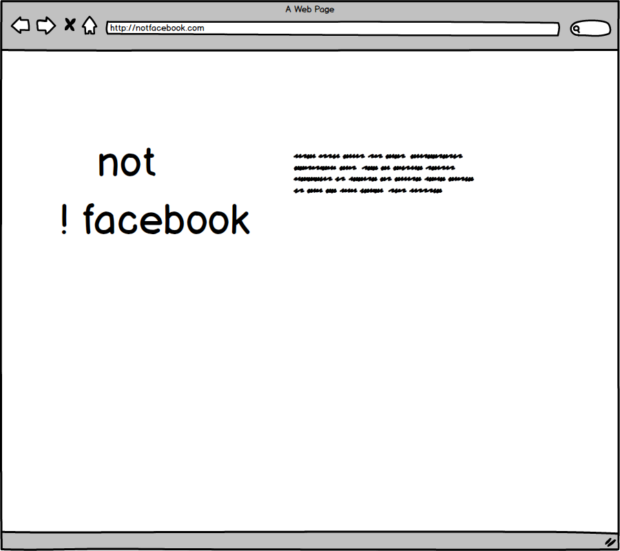
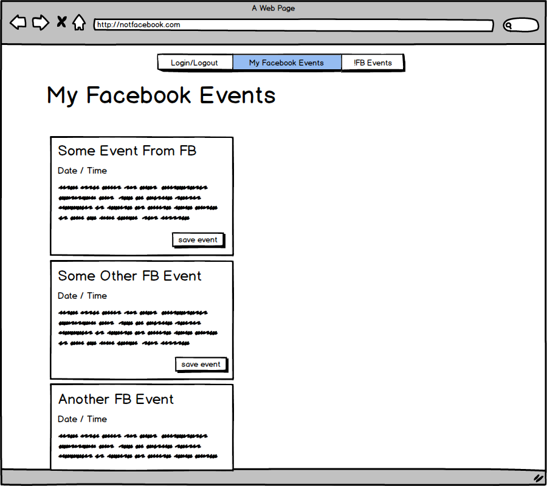
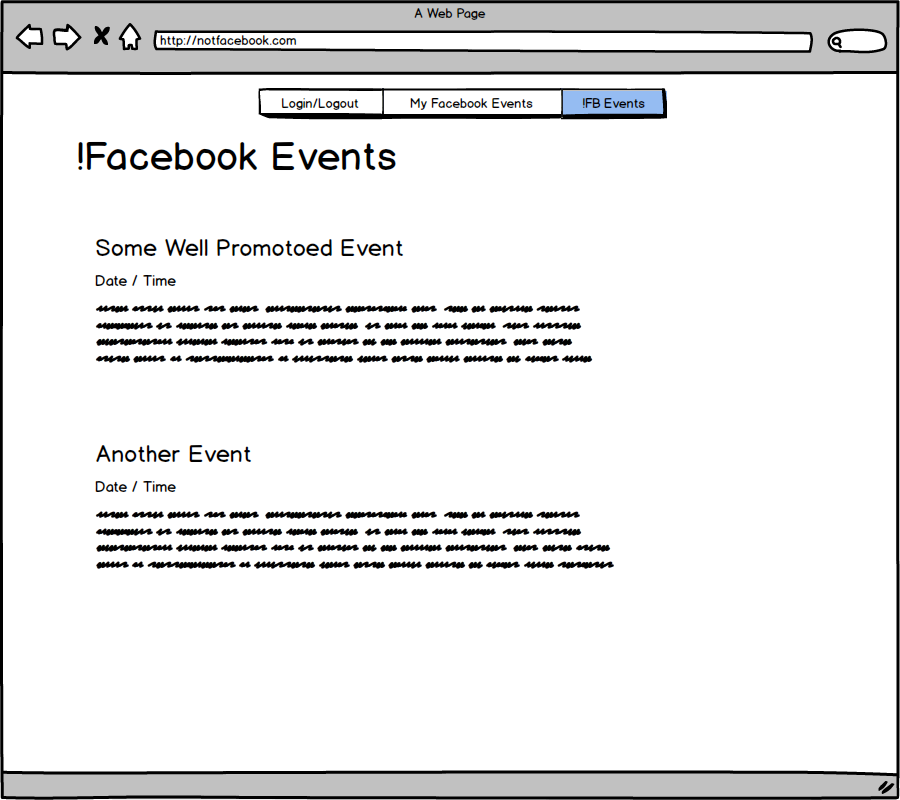

# README
#Not Facebook 

An application that allows users to publish selected facebook events onto a secondary website.
The overall concept is to encapsulate content generated in facebook onto a 3rd party website where it may reach a more targetted audience.

##Technologies: 

Ruby on Rails, Koala Gem, Omniauth-facbook gem, Postgres

##User Stories

A user should be able to login to facebook via !facebook

A user should be able to see items from their facebook events on !facebook

A user should be able to view all items posted on !facebook

A user should be able to save items from their event feed to !facebook

A viewer should be able to see all the events listed on !facebook

next steps

A viewer should be able to see a map of events by neighborhood
A user should be able to request reminders (ical? text notifications) regarding an event
A user should be able to delete their own posts
A user should be able to edit their own posts

##Known & Issues

Facebook login & omniauth is problematic
Perhaps integrating devise / omniauth may have done better in creating / destroying sessions

##Credits:

Thanks Classmates James / Joe / Suprit / Fizal / Table #01 of Purple Rain for helping along the way.

** Serge / Bobby / Jason at GA for thier instructional brinkmanship **

Omniauth / Facebook originally setup using examples from 
Ryan Bates at Railcasts 
http://railscasts.com/episodes/360-facebook-authentication

Followed up by Koala Integration noted here at Launch School
https://launchschool.com/blog/facebook-graph-api-using-omniauth-facebook-and-koala

